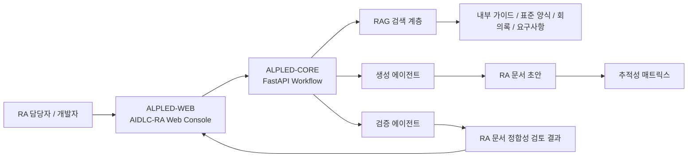
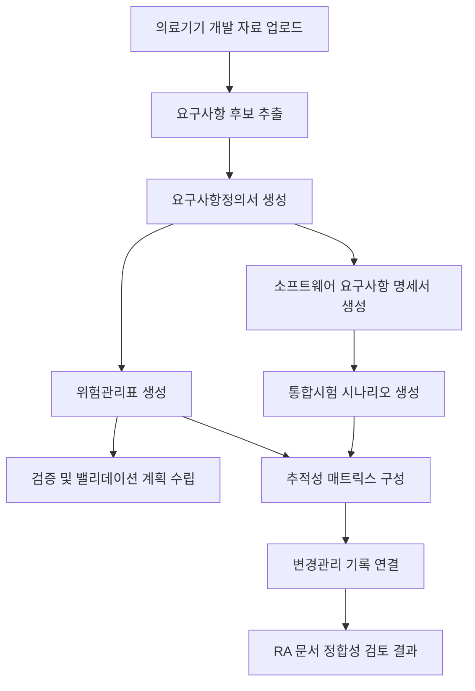

# AIDLC-RA: AI-DLC Based Regulatory Affairs Documentation Platform

AIDLC-RA는 의료기기 개발자가 인허가 및 품질문서 작성 과정에서 요구사항, 위험관리, 검증시험, 추적성 매트릭스를 일관되게 작성할 수 있도록 지원하는 RA(Regulatory Affairs) 문서 자동화 플랫폼입니다.

> 본 프로젝트는 의료기기 실제 인허가를 대신하는 서비스가 아닙니다. 의료 진단 또는 치료 목적의 소프트웨어가 아니라, 의료기기 개발 및 RA 문서 작성 과정을 보조하기 위한 포트폴리오용 문서 자동화 플랫폼입니다.

AIDLC-RA의 핵심은 의료 AI가 판단을 내리는 것이 아니라, 의료기기 개발 생명주기에서 반복적으로 작성되는 문서들을 구조화하고 문서 간 정합성을 검토하는 것입니다. 내부 가이드, 표준 양식, 회의록, 요구사항 문서를 RAG 기반으로 참고하여 RA 문서 초안을 생성하고, 별도의 검증 에이전트가 누락·불일치·추적성 단절 여부를 확인하는 구조를 지향합니다.

---

## 1. 프로젝트 개요

AIDLC-RA는 기존 ALPLED의 AI-DLC 문서 생성 구조를 의료기기 RA 취업 포트폴리오 관점으로 재해석한 프로젝트입니다. 요구사항정의서, 소프트웨어 요구사항 명세서, 위험관리표, 검증 및 밸리데이션 계획서, 통합시험 시나리오, 변경관리 기록, 추적성 매트릭스를 하나의 흐름으로 연결하여 작성할 수 있도록 구성했습니다.

한 줄 설명:

> 의료기기 개발자가 인허가 및 품질문서 작성 과정에서 요구사항, 위험관리, 검증시험, 추적성 매트릭스를 일관되게 작성할 수 있도록 지원하는 RA 문서 자동화 플랫폼

---

## 2. 개발 배경

의료기기 개발 과정에서는 제품 개발 자체만큼 문서화가 중요합니다. 특히 SaMD 또는 소프트웨어가 포함된 의료기기에서는 요구사항, 위험관리, 검증시험, 변경관리 문서가 서로 연결되어야 합니다.

하지만 실제 프로젝트에서는 다음 문제가 자주 발생합니다.

- 요구사항 문서와 시험 시나리오가 따로 작성되어 추적성이 약해짐
- 위험관리표의 위험통제 항목이 검증시험과 연결되지 않음
- 회의록에서 결정된 변경사항이 SRS, 위험관리, 시험 문서에 동시에 반영되지 않음
- 문서 작성자가 바뀌면 용어, ID, 근거 문서, 판단 기준이 달라짐
- 인허가 문서 작성 흐름을 이해하지 못하면 단순 개발 산출물처럼 보임

AIDLC-RA는 이 문제를 “문서 생성”이 아니라 “RA 문서 흐름 관리”의 관점에서 풀어보는 포트폴리오 프로젝트입니다.

---

## 3. RA 업무에서의 문제점

| 문제 | RA 관점 리스크 |
| --- | --- |
| 요구사항 ID가 문서마다 다름 | 추적성 매트릭스 작성이 어려움 |
| 위험통제와 시험항목이 분리됨 | 위험관리 파일의 검증 근거가 약해짐 |
| 변경 이력이 문서별로 흩어짐 | 변경관리 및 재검증 판단 누락 가능 |
| 생성 문서가 근거 없이 작성됨 | 보완 요청 대응이 어려움 |
| 문서 간 표현이 불일치함 | 사용 목적, 성능 주장, 시험 기준 충돌 가능 |

---

## 4. 해결 방향

AIDLC-RA는 다음 방향으로 문제를 해결합니다.

- 의료기기 개발 자료를 업로드하고 문서 유형별 RA 초안을 생성
- 요구사항, 위험, 시험, 변경 이력을 ID 기반으로 연결
- RAG를 활용해 내부 가이드, 표준 양식, 회의록, 요구사항을 문서 생성 근거로 사용
- 생성 에이전트와 검증 에이전트를 분리해 문서 작성과 검토 책임을 구분
- Validation Report 화면에서 누락 문서, 불일치, 미검증 위험통제 항목을 확인
- 실제 인허가 대체가 아니라 RA 실무 흐름 이해를 보여주는 포트폴리오로 구성

---

## 5. 주요 기능

- 의료기기 개발 자료 업로드
- 요구사항정의서 생성
- 소프트웨어 요구사항 명세서 생성
- 위험관리표 생성
- 검증 및 밸리데이션 계획서 생성 보조
- 통합시험 시나리오 생성
- 변경관리 기록 작성 보조
- 추적성 매트릭스 구성
- 문서 간 누락 및 불일치 체크
- 승인 요청 기반 RA 문서 정합성 검토
- RAG 기반 근거 문서 참조

---

## 6. 시스템 아키텍처

저장소 구조:

| 경로 | 역할 |
| --- | --- |
| `ALPLED-CORE/` | FastAPI, RAG, Agent, workflow 기반 RA 문서 생성·검토 백엔드 |
| `ALPLED-WEB/` | Django 기반 AIDLC-RA 웹 콘솔, 자료 업로드, 문서 생성, 승인/검토 UI |
| `FT/` | 요구사항 정규화 및 RA 문서 구조화 모델 파인튜닝 실험 영역 |
| `docs/` | RA 문서 유형과 플랫폼 설명 자료 |
| `config/` | 메뉴/화면 라벨 정의 예시 |
| `samples/` | 의료기기 예시 프로젝트 JSON 샘플 |

---

## 7. 문서 생성 파이프라인

파이프라인의 핵심은 문서를 개별 파일로만 생성하는 것이 아니라, 요구사항-위험-시험-변경 이력을 연결된 구조로 관리하는 것입니다.

---

## 8. 생성 에이전트 / 검증 에이전트 구조

### 생성 에이전트

생성 에이전트는 업로드된 개발 자료와 RAG 검색 결과를 바탕으로 문서 초안을 작성합니다.

담당 역할:

- 요구사항 분해 및 정규화
- RA 문서 템플릿에 맞춘 초안 작성
- 위험관리 항목 후보 생성
- 시험 시나리오 후보 생성
- 변경관리 기록 초안 작성

### 검증 에이전트

검증 에이전트는 생성된 문서가 서로 맞물리는지 확인합니다.

검토 항목:

- 요구사항 ID 누락 여부
- 위험통제 항목의 시험 연결 여부
- 시험 시나리오의 요구사항 커버리지
- 변경사항의 영향 문서 반영 여부
- 사용 목적과 성능 주장 간 불일치
- 진단·치료 목적으로 오해될 표현 여부

---

## 9. RAG 활용 방식

AIDLC-RA는 RAG를 단순 지식 검색이 아니라 문서 작성 근거 관리에 활용합니다.

사용 근거 예시:

- 내부 RA 문서 작성 가이드
- 표준 문서 양식
- 설계 검토 회의록
- 요구사항 문서
- 시험 결과 요약
- 변경관리 회의 기록
- 소프트웨어 개발 산출물

RAG 활용 흐름:

1. 업로드 문서를 chunking
2. 문서 유형, 섹션, 프로젝트, 근거 역할 메타데이터 부여
3. 생성 에이전트가 문서 유형별 근거 검색
4. 검색된 근거를 바탕으로 RA 문서 초안 작성
5. 검증 에이전트가 생성 문서와 근거 간 정합성 확인

---

## 10. 산출 문서 목록

| 산출 문서 | 설명 |
| --- | --- |
| 요구사항정의서 | 사용 목적, 사용자, 사용 환경, 기능/비기능 요구사항 정리 |
| 소프트웨어 요구사항 명세서 | SaMD 기능, 입력/출력, 예외 처리, 보안 요구사항 정리 |
| 위험관리표 | 위해요인, 위해상황, 위험통제, 잔여위험, 검증항목 연결 |
| 검증 및 밸리데이션 계획서 | 요구사항과 위험통제 항목을 검증할 시험 계획 정리 |
| 통합시험 시나리오 | 요구사항과 위험통제를 확인하는 시험 절차와 합격 기준 작성 |
| 변경관리 기록 | 변경 사유, 영향받는 문서, 재검증 필요 여부 기록 |
| 추적성 매트릭스 | 요구사항, 위험, 시험, 검증 결과, 변경 이력 연결 |
| RA 문서 정합성 검토 결과 | 누락, 불일치, 미검증 항목을 검토 결과로 표시 |

---

## 11. 의료기기 예시 시나리오

### 예시 1. 심박수 기반 운동강도 측정기

- 사용 목적: 운동 중 심박수 기반 운동강도 구간 표시
- RA 포인트: 비정상 심박수 입력 감지, 사용자 고지, 시험 시나리오 연결
- 주의: 질병 진단, 치료, 응급상황 판단 기능이 아님

### 예시 2. MRI 3D 시각화 연구용 소프트웨어

- 사용 목적: MRI 연구 데이터를 3D로 시각화하여 연구·교육 목적으로 확인
- RA 포인트: 연구용/비진단용 고지, 의료 판단 오인 방지, 화면 문구 검증
- 주의: 진단 판독, 병변 검출, 치료 계획 수립 기능이 아님

### 예시 3. 병원 내 문서 자동화 보조 시스템

- 사용 목적: 의료기관 내부의 반복 문서 작성과 검토 흐름 보조
- RA 포인트: 자동 생성 문서의 사용자 검토 필요 표시, 승인 단계 분리
- 주의: 환자 진단, 처방 추천, 임상 의사결정 기능이 아님

---

## 12. 화면 구성

AIDLC-RA Web Console은 RA 문서 흐름에 맞춰 메뉴명을 정리했습니다.

- RA Dashboard
- Development Evidence Upload
- RA Document Generator
- Risk Management File
- Traceability Matrix
- V&V Test Scenario
- Consistency Review Report
- Portfolio Notes
- Admin

---

## 13. 한계 및 비의료적 고지

AIDLC-RA는 다음을 수행하지 않습니다.

- 의료 진단
- 치료 결정
- 처방 추천
- 응급상황 판단
- 실제 인허가 승인 여부 판단
- 법적 효력이 있는 규제 자문
- 임상적 유효성 판단

본 프로젝트의 산출물은 실제 제출 문서가 아니라 RA 실무 흐름 이해를 보여주기 위한 포트폴리오 예시입니다. 실제 인허가 문서 작성에는 최신 법령, 고시, 가이드라인, 시험 기준, 품질시스템 문서, 전문가 검토가 필요합니다.

---

## 14. 포트폴리오 관점의 의미

이 프로젝트는 단순 CRUD 또는 일반 문서 생성 서비스가 아니라, RA 직무에서 중요한 다음 역량을 보여주기 위한 포트폴리오입니다.

- 의료기기 개발 생명주기 문서화 흐름 이해
- 요구사항, 위험관리, 검증시험, 추적성의 관계 이해
- SaMD 개발문서와 RA 문서 간 연결 구조 이해
- RAG 기반 문서 작성 보조 구조 설계
- 생성 에이전트와 검증 에이전트의 역할 분리 설계
- 문서 누락 및 정합성 검토 관점 반영
- 실제 인허가 대체가 아닌 보조 도구로 범위를 제한하는 표현 능력

면접 설명 문장 예시:

> AIDLC-RA는 의료 AI가 진단을 수행하는 프로젝트가 아니라, 의료기기 개발 과정에서 RA 담당자가 요구사항, 위험관리, 검증시험, 추적성 문서를 일관되게 작성하도록 돕는 문서 자동화 포트폴리오입니다. 생성 에이전트가 문서 초안을 만들고, 검증 에이전트가 누락과 불일치를 확인하도록 분리해 RA 실무의 문서 정합성 관점을 반영했습니다.

---

## 15. 향후 고도화 계획

- 실제 RA 문서 Word/PDF 템플릿 출력 고도화
- ISO 14971 기반 위험도 계산 로직 추가
- IEC 62304 스타일 소프트웨어 요구사항 추적성 강화
- 검증 및 밸리데이션 계획서 자동 생성 규칙 추가
- 문서 간 불일치 검출 규칙 엔진 구현
- RAG 근거 문장 출처 표시 기능 강화
- 변경관리 영향 분석 자동화
- Validation Report에서 요구사항-위험-시험 연결 그래프 시각화
- 의료기기 예시 프로젝트 seed 데이터 추가
- 사용자별 RA 프로젝트 포트폴리오 리포트 출력

---

## 16. v0.2 고도화 구현 내역

이번 버전에서는 향후 계획으로만 남겨두었던 항목을 포트폴리오 시연 가능한 서비스 로직과 설정 파일로 확장했습니다.

| 고도화 항목 | 반영 내용 |
| --- | --- |
| 실제 RA 문서 Word/PDF 템플릿 출력 고도화 | `config/ra-output-templates.json`와 export manifest 생성 로직 추가 |
| ISO 14971 기반 위험도 계산 | 발생가능성·심각도 기반 초기/잔여 위험도 계산 함수 추가 |
| IEC 62304 스타일 추적성 | 요구사항-위험-시험 매핑과 커버리지 계산 함수 추가 |
| V&V 계획서 자동 생성 규칙 | 요구사항, 위험관리, 시험 시나리오 기반 V&V 계획 초안 생성 |
| 문서 간 불일치 검출 | 누락 시험, 미연결 위험, 범위 고지 누락 검출 규칙 추가 |
| RAG 근거 출처 표시 | 근거 문장 출처 ID, 문서명, 섹션, 페이지 정규화 함수 추가 |
| 변경관리 영향 분석 | 변경 ID 기준 영향 문서와 재검증 필요 여부 분석 |
| Validation Report 그래프 | 요구사항-위험-시험 노드/엣지 생성 및 상세 화면 시각화 블록 추가 |
| 의료기기 seed 데이터 | 심박수, MRI, 문서 자동화, 병동 알림, QMS 예시 프로젝트 추가 |
| 사용자별 포트폴리오 리포트 | 사용자별 RA 프로젝트 Markdown 리포트 출력 함수 추가 |

핵심 구현 파일:

- `ALPLED-WEB/docs/ra_automation.py`
- `config/ra-output-templates.json`
- `samples/ra-seed-projects.json`
- `docs/ra-advanced-features.md`
- `tests/test_ra_automation.py`

---

## 17. RA 사용 주의사항 및 검토 기준

사용 시 주의사항은 RA 문서 기준으로 별도 정리했습니다.

- 상세 문서: [`docs/ra-usage-precautions.md`](docs/ra-usage-precautions.md)
- 연결 문서: [`docs/ra-document-types.md`](docs/ra-document-types.md)

핵심 원칙은 다음과 같습니다.

- 생성 결과는 초안이며 실제 인허가 제출 문서 또는 품질 승인 문서를 대체하지 않습니다.
- 의료 진단, 치료 결정, 처방 추천, 응급상황 판단, 임상적 유효성 판단에 사용하지 않습니다.
- 최신 법령, 고시, 국제표준, 기관별 양식, 품질시스템 절차와 반드시 대조해야 합니다.
- ISO 14971 위험도 계산, IEC 62304 추적성, RAG citation, 변경영향 분석은 RA 검토를 돕는 보조 지표입니다.
- 환자정보, 개인정보, 영업비밀, 승인되지 않은 임상자료는 샘플 또는 근거 문서에 포함하지 않습니다.
루트에서 바로 확인할 수 있는 요약 문서도 함께 제공합니다.

- [`RA-사용시-주의사항.md`](RA-사용시-주의사항.md)
