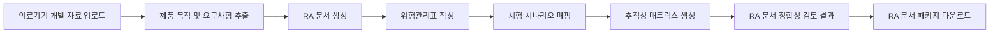

# AIDLC: AI-DLC 기반 의료기기 RA 문서 자동화 플랫폼

AIDLC는 AI-DLC 관점에서 의료기기 개발 자료를 구조화하고, RA(Regulatory Affairs) 문서 작성에 필요한 요구사항, 위험관리, 검증문서, 시험 시나리오, 변경관리 기록을 자동 생성·검토하는 포트폴리오용 문서 자동화 플랫폼입니다.

> 본 프로젝트는 의료 진단 또는 치료 목적의 소프트웨어가 아니라, 의료기기 개발 및 RA 문서 작성 과정을 보조하기 위한 포트폴리오용 문서 자동화 플랫폼입니다.

AIDLC는 의료 AI처럼 진단, 처방, 치료 결정, 의료 판단을 수행하지 않습니다. 개발자가 보유한 제품 설명, 요구사항, 시험 자료, 변경 이력, 규제 근거 문서를 바탕으로 RA 문서 초안을 작성하고 문서 간 정합성을 검토하는 보조 도구를 목표로 합니다.

---

## 1. 프로젝트 방향

기존의 단순 문서 생성 서비스를 다음과 같은 RA 문서 자동화 플랫폼으로 확장하는 것을 목표로 합니다.

- 의료기기 RA 문서 자동화
- SaMD 개발문서 작성 보조
- 요구사항과 시험 시나리오 자동 매핑
- 위험요소와 검증항목 연결
- 누락 문서 체크
- 문서 간 불일치 검출
- 근거 기반 RAG 문서 생성
- 규제 문서 템플릿 기반 출력

---

## 2. 핵심 메시지

AIDLC는 다음 범위를 명확히 지킵니다.

| 구분 | 내용 |
| --- | --- |
| 수행하는 일 | RA 문서 작성 보조, 개발문서 구조화, 검증자료 매핑, 정합성 검토 |
| 수행하지 않는 일 | 진단, 처방, 치료, 임상적 의사결정, 의료 판단 |
| 대상 사용자 | 의료기기 개발자, RA 담당자, QA 담당자, SaMD 프로젝트 관리자 |
| 목적 | 인허가 준비 문서의 누락과 불일치를 줄이고 문서 작성 흐름을 표준화 |

---

## 3. 주요 문서 유형

AIDLC가 생성하거나 검토하는 문서 유형은 다음과 같습니다.

1. 요구사항정의서
2. 소프트웨어 요구사항 명세서
3. 위험관리표
4. 검증 및 밸리데이션 계획서
5. 통합시험 시나리오
6. 변경관리 기록
7. 추적성 매트릭스

각 문서는 독립적으로 생성되는 것이 아니라, 요구사항, 위험요소, 시험 케이스, 변경 이력, 검증 결과가 서로 연결되도록 설계합니다.

---

## 4. 메뉴 구조

초기 플랫폼 화면은 아래 메뉴 구조를 기준으로 정리합니다.

| 메뉴 | 목적 |
| --- | --- |
| Dashboard | 프로젝트 현황, 문서 완성도, 누락 항목 요약 |
| Project Upload | 의료기기 개발 자료 업로드 |
| RA Document Generator | RA 문서 생성 |
| Risk Management | 위험요소, 위해상황, 검증항목 연결 |
| Traceability Matrix | 요구사항-위험-시험-검증 결과 추적 |
| Test Scenario | 통합시험 시나리오 생성 및 검토 |
| Validation Report | RA 문서 정합성 검토 결과 확인 |
| Admin | 템플릿, 규제 근거, 사용자 설정 관리 |

---

## 5. 화면 문구 기준

AIDLC의 화면 문구는 일반적인 문서 생성 서비스처럼 보이지 않도록 RA 중심으로 표현합니다.

| 기존 표현 | 변경 표현 |
| --- | --- |
| 문서 생성 | RA 문서 생성 |
| 검증 결과 | RA 문서 정합성 검토 결과 |
| 프로젝트 업로드 | 의료기기 개발 자료 업로드 |
| 결과 다운로드 | RA 문서 패키지 다운로드 |
| 테스트 생성 | 통합시험 시나리오 생성 |
| 위험 분석 | 의료기기 위험관리표 작성 |
| 요구사항 목록 | RA 요구사항 추적 목록 |
| 관리자 | 규제 템플릿 관리자 |

자세한 화면 라벨과 라우팅 이름은 `config/navigation-labels.json`에 정리했습니다.

---

## 6. RA 관점 주요 기능

### 요구사항과 시험 시나리오 자동 매핑

제품 요구사항과 소프트웨어 요구사항을 입력하면 관련 시험 시나리오를 추천하고, 요구사항 ID와 테스트 케이스 ID를 추적성 매트릭스에 연결합니다.

### 위험요소와 검증항목 연결

위해요인, 위해상황, 위해, 초기 위험, 위험통제 방법, 잔여위험을 정리하고 각 위험통제 항목이 어떤 검증시험으로 확인되는지 연결합니다.

### 누락 문서 체크

제품 유형과 개발 단계에 따라 필요한 문서를 체크하고, 요구사항정의서, SRS, 위험관리표, 검증계획서, 시험 시나리오, 변경관리 기록, 추적성 매트릭스의 누락 여부를 표시합니다.

### 문서 간 불일치 검출

사용 목적, 성능 주장, 위험통제 방법, 시험 항목, 사용설명서 표현이 서로 충돌하거나 누락되는 경우 정합성 검토 결과로 표시합니다.

### 근거 기반 RAG 문서 생성

업로드된 규제 문서, 내부 템플릿, 시험 자료, 개발 산출물을 근거로 사용하여 문서 초안을 생성합니다. 생성 결과에는 참조 근거와 출처를 함께 표시하는 것을 목표로 합니다.

### 규제 문서 템플릿 기반 출력

RA 문서가 자유 형식으로 흩어지지 않도록 정해진 템플릿에 따라 요구사항정의서, 위험관리표, 검증계획서, 시험 시나리오, 변경관리 기록을 출력합니다.

---

## 7. 샘플 프로젝트

샘플 데이터는 `samples/medical-device-projects.json`에 정리했습니다.

포함된 예시:

- 심박수 기반 운동강도 측정기
- MRI 3D 시각화 연구용 소프트웨어
- 의료기관 문서 자동화 시스템

각 샘플은 제품 목적, RA 문서 범위, 위험요소, 검증 항목, 추적성 예시를 포함하도록 구성했습니다.

---

## 8. 문서 자동화 흐름

---

## 9. 포트폴리오에서 강조할 점

AIDLC는 단순히 문장을 생성하는 프로젝트가 아니라, 의료기기 개발 생명주기와 RA 문서 체계를 연결하는 프로젝트입니다.

강조 포인트:

- AI-DLC 흐름을 요구사항, 위험관리, 검증, 변경관리 문서로 구조화
- SaMD 개발문서와 RA 문서의 추적성 확보
- 진단/치료 AI가 아닌 RA 업무 보조 도구로 범위 명확화
- RAG 기반 문서 생성과 템플릿 기반 출력의 결합
- 문서 간 불일치와 누락 항목을 검토하는 정합성 중심 설계

---

## 10. 향후 구현 예정 기능

- 실제 업로드 파일 파싱 기능
- 문서 유형별 생성 화면 구현
- RAG 검색 결과의 근거 문장 표시
- 추적성 매트릭스 자동 생성 로직
- 위험관리표 위험도 계산 로직
- 문서 간 불일치 검출 규칙 엔진
- RA 문서 패키지 PDF/Word 출력
- 사용자별 프로젝트 관리 기능

---

## 11. 면책 문구

본 프로젝트의 결과물은 포트폴리오 및 학습 목적의 문서 자동화 예시입니다. 실제 의료기기 인허가 제출, 품질시스템 운영, 임상시험, 광고 심의, 사후관리 업무에는 최신 법령, 고시, 가이드라인, 시험 기준, 전문가 검토가 필요합니다.
